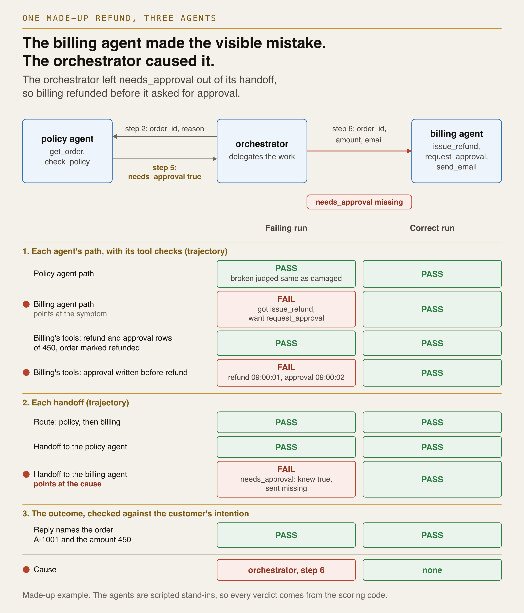
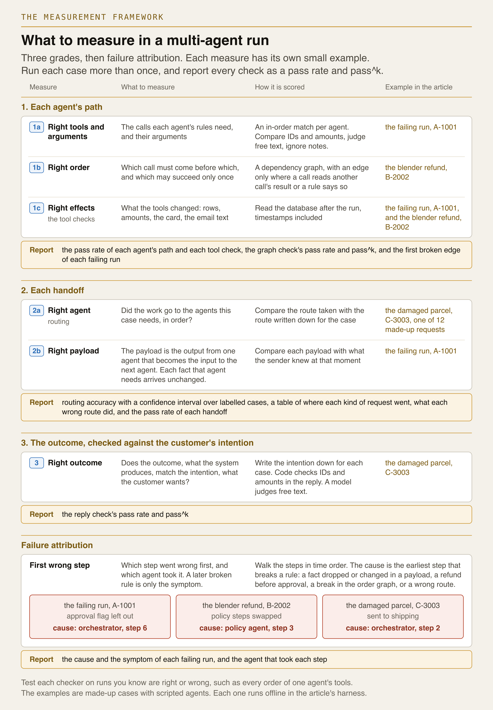
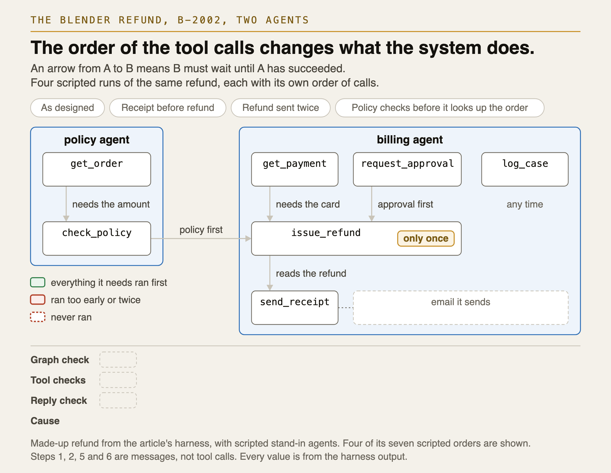
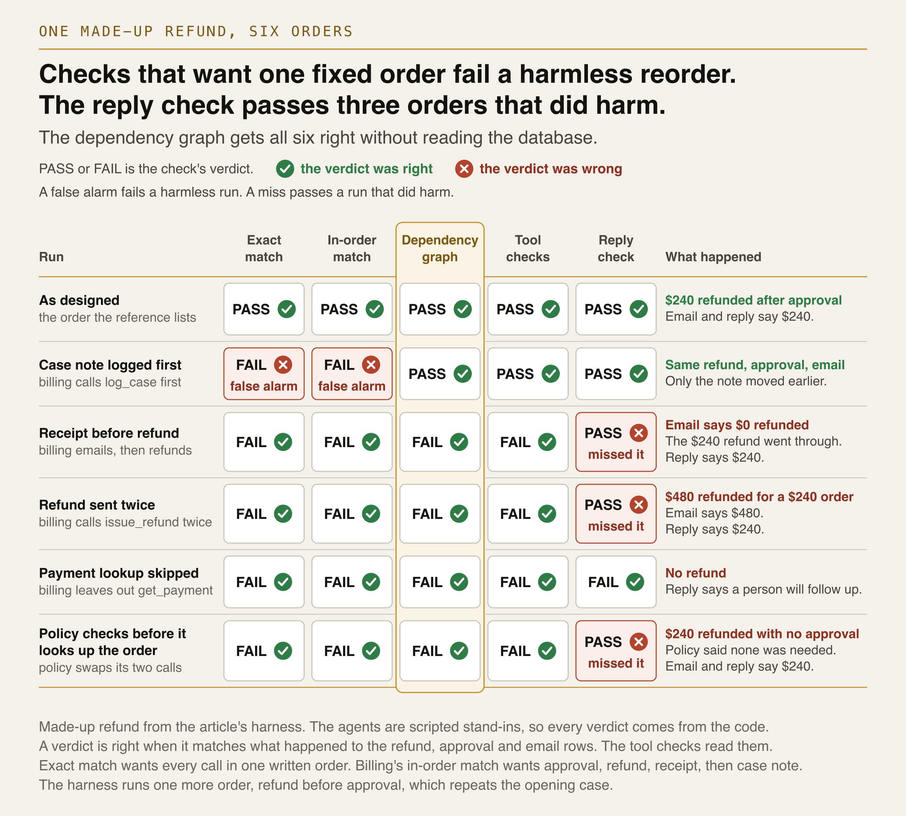
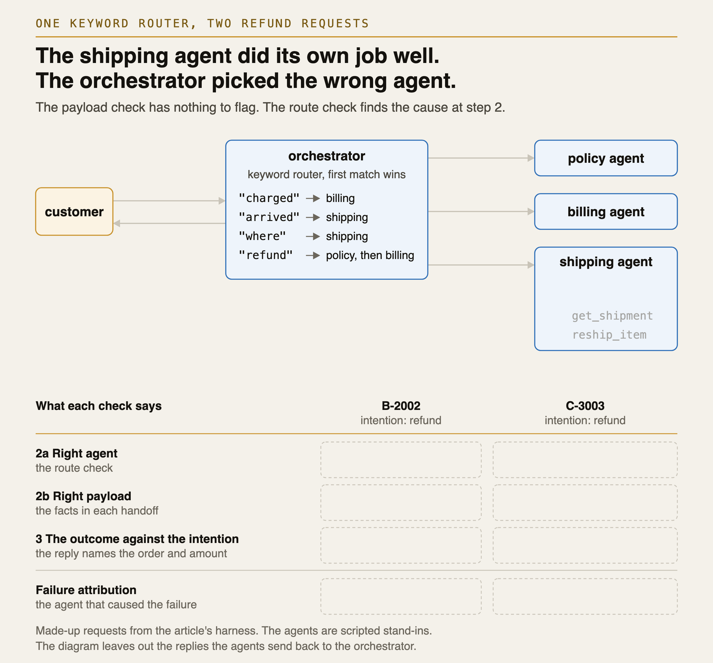
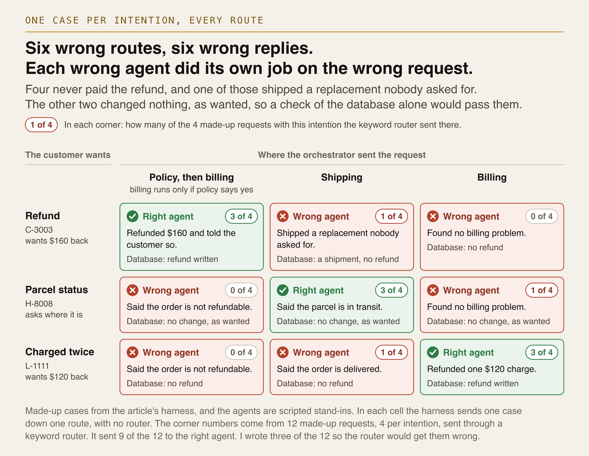
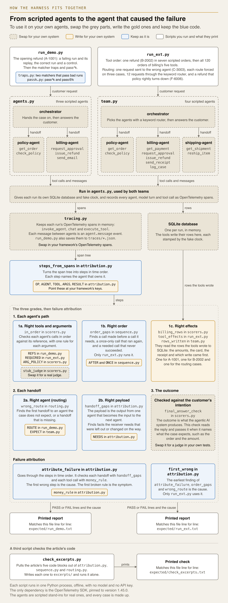
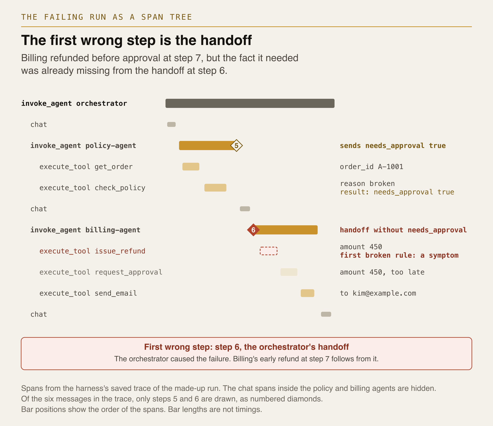
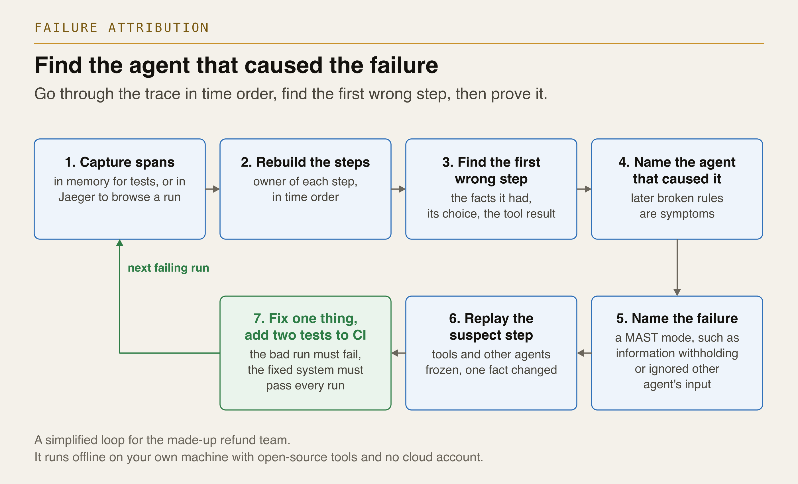

# multi-agent-trajectory-evals

[](https://github.com/netsatsawat/multi-agent-trajectory-evals/actions/workflows/ci.yml)

If you have built a multi-agent system, you may have a test that reads only the final reply.
That test can pass a run where the money went out before anyone approved it. This repo grades
each run on three things, then names the agent that caused the failure:

1. Each agent's path: the right tools with the right arguments, in an order that works, with
   the right effects.
2. Each handoff, the message that passes work to the next agent: the right agent gets the work,
   with the facts it needs.
3. The outcome, checked against the customer's intention. The intention is what the customer
   wants, and the outcome is what the agentic AI system produces.



In the opening case, a customer asks for a $450 refund on order A-1001. Policy reports that the
refund needs approval. In run A, the orchestrator leaves that flag out of its handoff to
billing, so billing refunds before it asks for approval. The reply is still right. Billing made
the visible mistake, but the orchestrator caused it. A grader that checks only the agent whose
action looks wrong names billing, and you fix billing while the orchestrator keeps dropping the
flag.

The agents are scripted Python stand-ins and every case is made up, so it all runs offline with
no model and no API key. The checks read OpenTelemetry spans, so they also work on your own
agents. I wrote this code as the harness for my article *Multi-Agent Trajectory Evaluation,
Explained Simply* (Towards AI, in draft).

## Quickstart

```bash
uv venv --python 3.12 && uv pip install -r requirements.txt
.venv/bin/python run_demo.py
.venv/bin/python run_ext.py
.venv/bin/python check_excerpts.py
```

Without uv, run `python3.12 -m venv .venv && .venv/bin/pip install -r requirements.txt`. The
only dependency is the OpenTelemetry SDK, pinned to 1.45.0.

- `run_demo.py` prints the opening refund. Run A drops the flag, run B is the correct system,
  and run C is a control where billing ignores the flag. Each run gets its span tree, its steps,
  every check and the cause. Then come the replay, two matcher traps and pass^k over eight runs.
  It also saves the spans of runs A, B and C to `traces/`.
- `run_ext.py` prints the cases for a bigger four-agent team: one refund in seven tool orders,
  a test of the order checkers on all 120 orders of billing's tools, a request sent to the wrong
  agent, every route forced on one case per intention, 12 requests through a keyword router, and
  a false-alarm test.
- `check_excerpts.py` pulls out the five code blocks the article prints, checks their length,
  writes them to `excerpts/` and runs each one alone.

Each script prints the same output every time, so CI compares it with its copy in `expected/`.
On your copy, `diff <(.venv/bin/python run_ext.py) expected/run_ext.txt` should print nothing.

## What to measure

Each grade breaks into one to three measures, and each measure has its own small case.



| Measure | Code that scores it | What to report | Its case |
|---|---|---|---|
| 1a. Right tools and arguments | `in_order`, with a rule per argument | Path pass rate per agent | The opening refund (A-1001) |
| 1b. Right order | `order_gaps` and a dependency graph | Pass rate, pass^k and the first broken edge | A blender refund (B-2002) |
| 1c. Right effects | `billing_rows`, `tool_effects` | Pass rate per check | A-1001 and B-2002 |
| 2a. Right agent (routing) | `wrong_route` | On sampled cases: accuracy with an interval, routes taken per intention, what each wrong route did | A damaged parcel (C-3003), 12 requests |
| 2b. Right payload | `handoff_gaps` | Pass rate per handoff | A-1001 |
| 3. The outcome against the intention | `final_answer_check`, or a judge | Pass rate and pass^k | C-3003 |
| Failure attribution | `attribute_failure`, `first_wrong` | The cause and symptom of each failing run, confirmed by a person | A-1001, B-2002, C-3003 |

## Grade 1: each agent's path

Let's start with the trajectory, the path the agents took. `steps_from_spans` (excerpt 1)
rebuilds it as numbered steps in time order. A step is one tool call or one message, including
the customer's request and the final reply.

### 1a. Right tools and arguments

`in_order` in `scorers.py` compares each agent's calls, in order, with a short reference list
(`REFS` in `run_demo.py`). The list holds only the calls the rules need, so an extra call such as
billing's `send_email` can come anywhere. Each argument gets a rule. IDs and amounts must match
exactly, because a wrong amount moves real money. Billing's free-text `note` is ignored. A
free-text reason goes to a judge, here `stub_judge`, a synonym table that treats "broken" as
"damaged" so the demo needs no model. In run A, billing's path fails at its first call, where it
got `issue_refund` and wanted `request_approval`.

Test a matcher before you trust it. `traps.py` holds two common matchers, naive contains-all and
greedy in-order. Both pass an empty reference list, which you get when a reference fails to load,
and both pass a run that refunds, asks for approval, then refunds again. The fixed matcher,
`in_order`, fails both runs.

### 1b. Right order

The order matters when one call reads another call's result, or when a rule says one step comes
first. A reference list fixes one order, so it also fails orders that do no harm. A dependency
graph only says which call must come before which, and no edge means any order. We add an edge
only where a call reads another call's result or a rule says so.

The case is a made-up blender refund on the bigger team in `team.py`: "My blender B-2002 is
broken. I need a refund." The order cost $240. Here billing has five tools, and `check_policy`
takes the amount from `get_order`'s result, so the graph covers seven tools across policy and
billing:

```python
AFTER = {  # tool: the tools that must succeed before it runs
    "check_policy": ["get_order"],
    "issue_refund": ["check_policy", "get_payment",
                     "request_approval"],
    "send_receipt": ["issue_refund"],
    "log_case": []}  # needed, at any time
ONCE = {"issue_refund"}  # may succeed only one time per case
```

Each edge has a reason. Policy needs the amount before it checks, no money moves before policy
says yes, the refund needs the payment ID, refunds over $100 need approval, and the receipt
reads the refund rows. There is no edge between `get_payment` and `request_approval`, so either
can go first.

`order_gaps` in `sequence.py` (excerpt 4) reports three kinds of finding: a call made before a
call it needs, a once-only call that runs again after it succeeded, and a needed call that never
succeeded. A call that returned an error does not count as done. The case note from `log_case`
has no edge, so it can come at any time. Hence, `order_gaps` only reports it if it never
succeeded, and the "one case note" check in `tool_effects` counts the notes.



`run_ext.py` runs the refund in seven scripted orders and scores each one with five checks:

| Run | What happened | Exact | In order | Graph | Effects | Reply | Cause |
|---|---|---|---|---|---|---|---|
| As designed | $240 back to the card | PASS | PASS | PASS | PASS | PASS | none |
| Case note logged first | The same | FAIL | FAIL | PASS | PASS | PASS | none |
| Refund before approval | $240 out before approval | FAIL | FAIL | FAIL | FAIL | PASS | billing, step 8 |
| Receipt before refund | Email says "$0 refunded" | FAIL | FAIL | FAIL | FAIL | PASS | billing, step 9 |
| Refund sent twice | $480 out | FAIL | FAIL | FAIL | FAIL | PASS | billing, step 10 |
| Payment lookup skipped | No refund | FAIL | FAIL | FAIL | FAIL | FAIL | billing, step 8 |
| Policy checks before it looks up the order | $240 out, no approval | FAIL | FAIL | FAIL | FAIL | PASS | policy, step 3 |

Exact match and the in-order list fail the run that logs the case note first, which does no
harm. The graph passes it and fails every run that changed what the system did. The reply check
passes four of the five harmful runs. In the last run, billing followed its handoff, and the
mistake was policy's, at step 3.



A checker can be wrong too. `run_ext.py` runs billing's five tools in all 120 orders, and in 10
of them every tool effect check and the reply pass. Exact match accepts 1 of those 10. The
in-order list accepts 2, because it rejects every good order that logs the case note before the
receipt. The graph accepts all 10 and none of the 110 wrong orders, while the reply check
accepts the 50 wrong orders in which the refund went through.

Both the graph and the database checks come from the same rules, so they agree on every order.
Hence, this test is best at catching bugs in the graph. Leave out the approval edge and the
graph accepts 10 wrong orders. Leave out the receipt edge and it accepts 30. Count a failed call
as done and drop the payment edge, and it accepts 10. Without the once-only rule, the refund
sent twice passes.

### 1c. Right effects

The tool checks read what changed: the rows, the amounts, the card and the email text. The
reply can be right while these are wrong. For A-1001, `billing_rows` in `scorers.py` expects one approval and one refund of 450, the approval
first, and the order marked refunded. In run A, the refund row is stamped 09:00:01 and the
approval 09:00:02, so the approval-before-refund check fails. For B-2002, `tool_effects` in
`run_ext.py` expects one $240 refund to the card that paid, an approval before it, a receipt
that says $240 and one case note. The rows show the order only because a fake clock stamps
each one, so if your backend keeps no write times, only the trajectory shows it.

## Grade 2: each handoff

### 2a. Right agent: routing

A wrong agent can do its own job well while the system does the wrong job for the customer. When
a model picks the next agent, frameworks such as the
[OpenAI Agents SDK](https://openai.github.io/openai-agents-python/handoffs/),
[ADK](https://adk.dev/workflows/collaboration/) and
[LangChain](https://docs.langchain.com/oss/python/langchain/multi-agent/handoffs) record the pick
as a tool call that names the target, so the route is already in the trace. In this repo, it is
the `to` field of each `agent.message` event. `wrong_route` in `routing.py` (excerpt 5) returns
the first handoff to an agent the case does not expect next.

Write down the expected route for each case. The intention alone is not enough, because a refund
that policy rightly turns down stops at policy. `EXPECT` in `team.py` holds four labels: a
refund, a refund turned down, a parcel status question and a double charge.

A customer writes, "Order C-3003 arrived damaged. Refund please." The order cost $160, so the
expected route is policy, then billing. The keyword router's rule for "arrived", written for late
parcels, matches first and sends the work to shipping. Shipping does its own job and ships a
replacement nobody asked for. The rows and the reply fail. Only the route check names the cause:
the orchestrator, at step 2.



To see what each wrong agent does, `run_ext.py` forces every route on one case of each intention:



Then 12 made-up requests, four per intention, go through the keyword router, which takes the
first rule whose word appears. I wrote three of them to trip it, one per intention, so the count
describes these cases and this router. Nine of the 12 went where expected:

| Intention | To policy, then billing | To shipping | To billing |
|---|---|---|---|
| Refund | 3 | 1 | 0 |
| Parcel status | 0 | 3 | 1 |
| Charged twice | 0 | 1 | 3 |

Each wrong route did different harm. C-3003 got a replacement and no refund. K-1010 ("I was
charged for K-1010 last week. When will it ship?") went to billing, which wrote nothing, so its
rows check passes and only the route and the reply catch it. N-1313 ("I paid twice for N-1313,
where is my money?") went to shipping, and the second charge was never refunded.

The last block of `run_ext.py` is a false-alarm test: "I changed my mind about the lamp from
F-6006. Can I get a refund?" Policy turns it down, and the work stops at policy. With the label
"refund turned down", every check passes. With the intention "refund" alone, the checks expect
billing too, and they name the orchestrator at step 7 for a run that did the right thing. The
same gap shows up the other way. If policy wrongly turns down a refund the case expects, the
checks name the orchestrator for stopping after policy, because no rule here checks policy's
verdict against the label.

Measure routing on cases sampled from your real traffic. `wilson` in `routing.py` gives a 95%
interval. [Shu et al.](https://arxiv.org/abs/2412.05449) also measure
routing as accuracy against decisions that people labelled by hand.

### 2b. Right payload

The payload is the output from one agent that becomes the input to the next agent.
`handoff_gaps` in `attribution.py` (excerpt 2) checks that each fact the receiver needs, listed
in `NEEDS`, arrives with the value the sender knew by then. In run A, policy tells the
orchestrator `needs_approval: true` at step 5. The handoff to billing at step 6 leaves it out,
so the check prints `needs_approval: knew True, sent '<missing>'`.

What a receiver needs depends on the job. Billing needs four facts after a policy verdict but
only the order ID for a double charge, so `needs_for` in `team.py` swaps in each case's list.
The check knows only the agents each job needs. C-3003's handoff to shipping passes it with
nothing to check.

## Grade 3: the outcome, checked against the customer's intention

`final_answer_check` in `scorers.py` passes the reply when it names what the case expects, the
order ID and the amount for a refund. In run A, the outcome matches the customer's intention,
since the customer gets the refund and the right reply. Only the two trajectory grades catch the
broken approval rule. C-3003's reply, "A replacement for order C-3003 is on its way.", fails the
refund intention. A reply that names the ID and the amount but turns the refund down would still
pass, so use a judge for this check in your own tests.

Run each case more than once. `run_demo.py` runs the opening refund eight times with a flaky
orchestrator that drops the flag one time in four. With a fixed random seed, the same five runs
pass all three grades every time. Pass^k is the chance that all k runs pass when you pick k of
the eight at random. `passk.py` uses tau-bench's formula, C(c, k) / C(n, k), with n = 8 runs
and c = 5 passes. At k = 1 it gives 0.625, the plain pass rate. At k = 8 it gives 0.000.
Pass@k, the chance that at least one passes, reaches 1.000 at k = 4, because with three
failures any four runs include a pass.

## Which agent caused the failure?

`attribute_failure` in `attribution.py` (excerpt 3) goes through the steps in time order. A
handoff is wrong when it fails the payload check, and a tool call is wrong when it breaks
`money_rule`, which here is approval before a refund. The first wrong step is the cause, and its
owner is the agent that made that call or sent that message. The first broken rule is the
symptom when it comes later. For run A, `run_demo.py` prints:

```
  cause: orchestrator, step 6 (handoff to billing-agent). symptom: billing-agent's issue_refund at step 7
```

`order_gaps` and `wrong_route` return findings in the same shape, so `first_wrong` takes the
earliest one under every rule. [Who&When](https://arxiv.org/abs/2505.00212) also takes the
earliest error as the main cause. When policy checks before it looks up the order, the handoff
and money rules alone name billing at step 8. The order check moves the cause to policy at
step 3. In the C-3003 run, the handoff and money rules find nothing, and the route check names
the orchestrator at step 2.

The replay confirms step 6 in run A. It runs billing alone on a fresh database with
`needs_approval: true` put back into the handoff, and both of billing's failed checks pass. In
run B, every check passes and no one is named. In run C, the control, the handoff carries the
flag, billing refunds first anyway, and billing is named at step 7.

## How it works



Each run gets its own SQLite database and a fake clock, so every run writes the same timestamps.
`agents.py` holds the three agents of the opening case, and `team.py` the four of the bigger
team. Both record each run as OpenTelemetry spans that follow the GenAI semantic conventions.
Each agent gets an `invoke_agent` span that holds its `chat` and `execute_tool` spans and the
spans of any agent it calls. Each message between agents is a span event named `agent.message`.



## Use it on your own agents

Copy `attribution.py`, `sequence.py`, `routing.py`, `scorers.py` and `passk.py` into your project
and edit the copies there, since they import nothing else from this repo and edits made here
can fail CI.

1. Instrument your framework with OpenTelemetry GenAI spans, and turn on message content for
   test runs. In OpenTelemetry's Python GenAI packages, set
   `OTEL_INSTRUMENTATION_GENAI_CAPTURE_MESSAGE_CONTENT=SPAN_ONLY` and
   `OTEL_SEMCONV_STABILITY_OPT_IN=gen_ai_latest_experimental`, or create the spans by hand as
   `agents.py` does. In your test, add an `InMemorySpanExporter` as `tracing.py` does, and pass
   one run's `get_finished_spans()` to `steps_from_spans`.
2. Change `OP`, `AGENT`, `TOOL`, `ARGS` and `RESULT` in `attribution.py` to your framework's keys.
   Google's ADK, for example, writes tool arguments and results under
   `gcp.vertex.agent.tool_call_args` and `gcp.vertex.agent.tool_response`.
3. The GenAI conventions have no handoff event yet. Record every message between agents, replies
   as well as handoffs, as an `agent.message` span event with `from`, `to` and the facts as JSON
   in `content`, the way `_message_event` in `agents.py` does. `attribute_failure` learns what a
   sender knew from the messages that reached it, so without policy's reply at step 5, it names
   the orchestrator even in the correct run.
4. Label each case with the customer's intention and the expected route, like `EXPECT` in
   `team.py`. From that label, write the reference lists (`REFS`), a rule per argument
   (`ARG_POLICY`, where an unlisted argument must match exactly), the order graph (`AFTER`,
   `ONCE` and `OWNER`), what the tools must change (`billing_rows`, `tool_effects`), the facts
   each receiver needs (`NEEDS`, with `needs_for` when one agent does two jobs) and your rules
   for tool calls (`money_rule`). Without your own rules, `attribute_failure` only finds
   handoffs that drop or change a fact.
5. Test each checker on runs you know are wrong: the trap runs in `traps()` in `run_demo.py` for a matcher, every
   order of one agent's tools for a graph (`checker_test` in `run_ext.py`), and runs you labelled
   yourself before a model judge replaces `stub_judge`.
6. Score all three grades and run each case several times. Report pass^k next to the pass rate.
7. Find the earliest wrong step with `first_wrong`. When it is a handoff, replay the receiving
   agent alone with the missing fact put back. `replay_check` in `run_demo.py` only works for the
   scripted billing agent, so write your own. Then fix one thing and add two tests to CI: the
   recorded bad run must still fail, and the fixed system must pass every repeated run.



The code here runs boxes 1 to 4, and item 7 covers boxes 6 and 7. Box 5 is done by hand. You
name the failure with a mode from [MAST](https://arxiv.org/abs/2503.13657), such as information
withholding, so you can count how often each kind happens.

## The limits

The agents, the router and the tool orders are all scripted, so the counts here describe how the
checks behave. To learn how often a real model fails them, run the checks on your own system.
The 12 routing requests are made up, and `run_ext.py` prints no interval for them.

Every refund in `team.py` is above $100, so `money_rule` (approval before any refund) and the
policy (approval above $100) always agree.

OpenTelemetry still marks the GenAI semantic conventions as Development. Pin the version of
your instrumentation. An
[open pull request](https://github.com/open-telemetry/semantic-conventions-genai/pull/447)
proposes a standard record of the agent a handoff goes to.

The checks name no one when a failure breaks none of their rules. If you ask a model to find the
agent instead, be careful. In the [Who&When](https://arxiv.org/abs/2505.00212) study, the best
method named the right agent only 53.5% of the time.

## Further reading

- [OpenTelemetry GenAI semantic conventions](https://github.com/open-telemetry/semantic-conventions-genai/tree/main/docs/gen-ai), and the [open issue on multi-agent traces](https://github.com/open-telemetry/semantic-conventions-genai/issues/243)
- [tau-bench](https://arxiv.org/abs/2406.12045), the source of pass^k
- [ToolSandbox](https://arxiv.org/abs/2408.04682), which writes a task's steps as a graph of order dependencies, much like `AFTER`
- [Who&When](https://arxiv.org/abs/2505.00212), on naming the agent and step behind a multi-agent failure
- [MAST](https://arxiv.org/abs/2503.13657), a study of why multi-agent systems fail
- [Shu et al.](https://arxiv.org/abs/2412.05449), on evaluating multi-agent collaboration, routing included
- [AgentRewardBench](https://arxiv.org/abs/2504.08942), on how often LLM judges of agent runs are wrong

---

Written by [Satsawat Natakarnkitkul](https://satsawat.ai). Companion article:
*Multi-Agent Trajectory Evaluation, Explained Simply* (Towards AI, in draft). Newsletter:
[AI in Practice](https://satsawat.ai/#subscribe). License: MIT.
