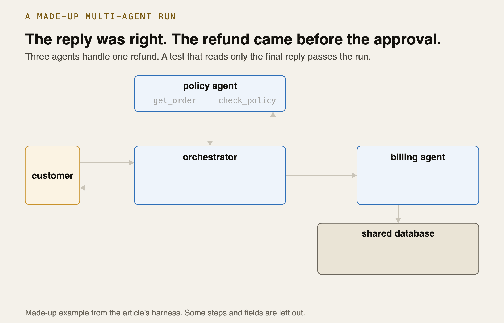
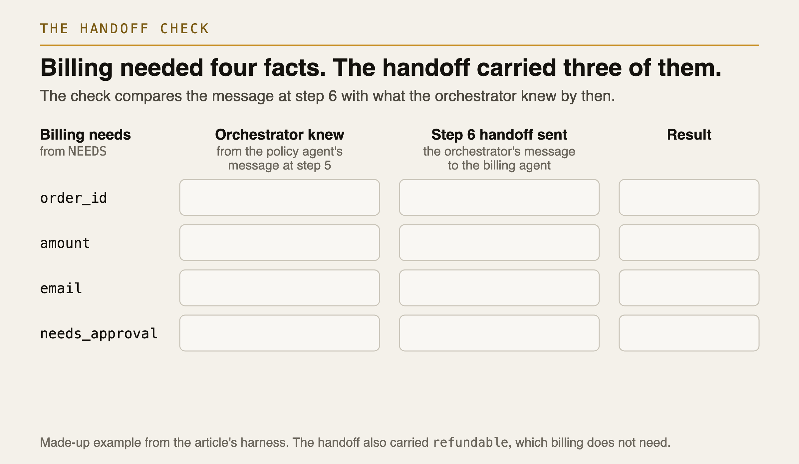
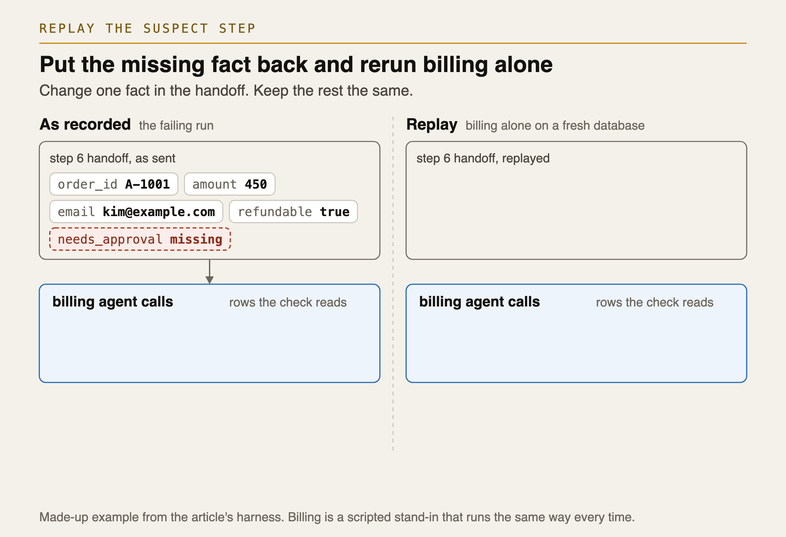
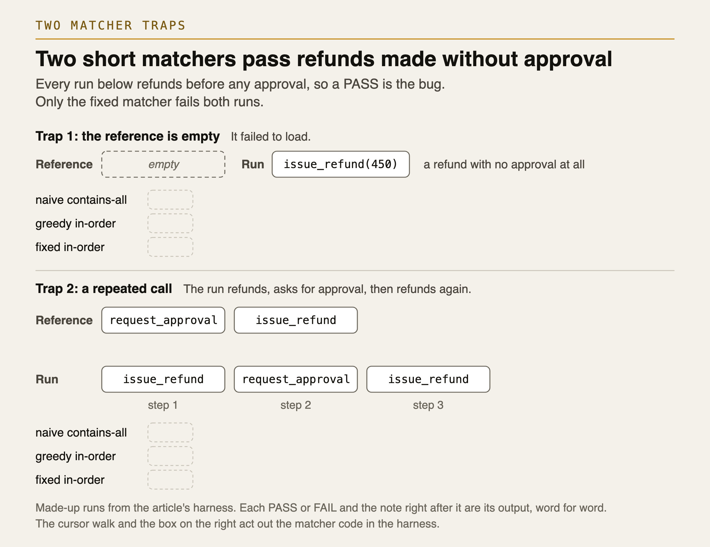
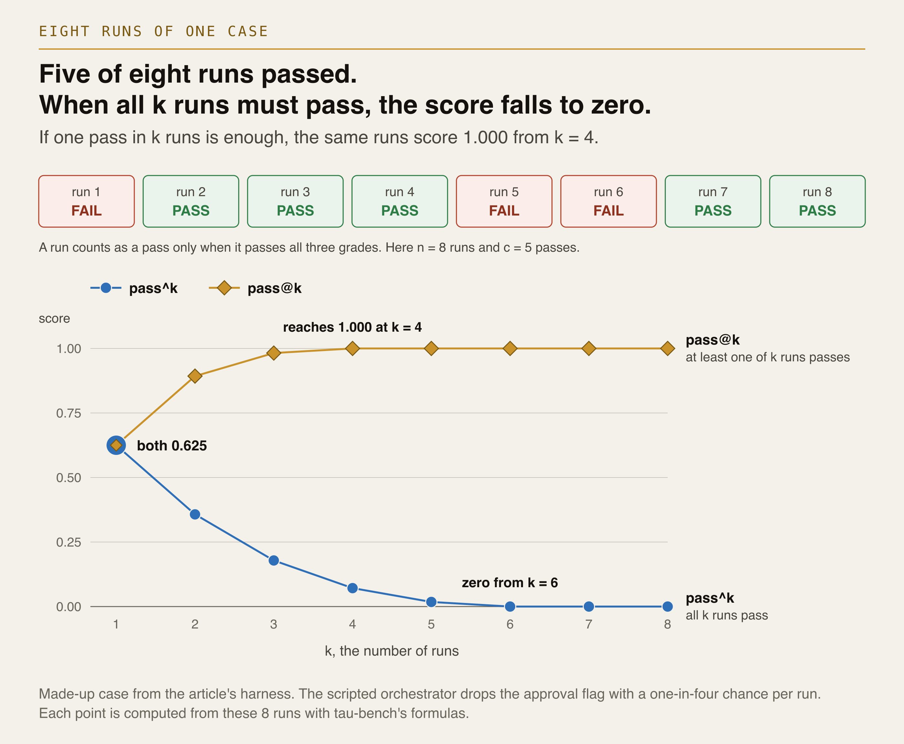
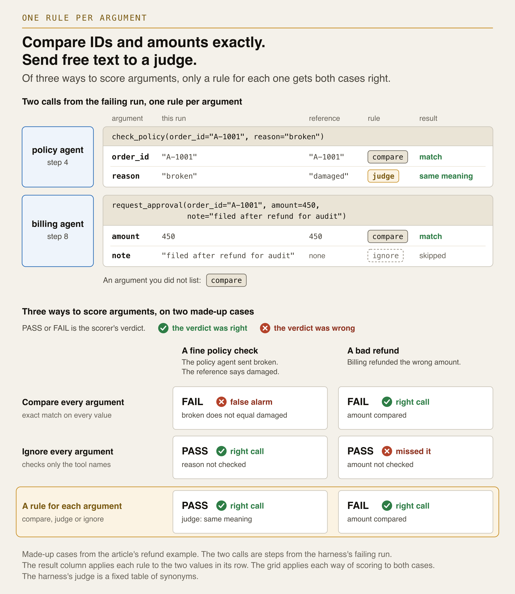

# multi-agent-trajectory-evals

[](https://github.com/netsatsawat/multi-agent-trajectory-evals/actions/workflows/ci.yml)

A test that reads only the final reply can pass a multi-agent run where the money goes out
before anyone approves it. This repo grades each run on each agent's path with its tool calls,
on each handoff between agents, and on whether the customer got what they asked for. Then it
names the agent that caused the failure.



A customer writes, "My order A-1001 arrived broken. Refund please." The order cost $450. An
orchestrator agent sends the case to a policy agent, which looks up the order and checks the
refund rules. The rules say any refund over $100 needs approval, so the policy agent reports
`needs_approval: true` back to the orchestrator. The orchestrator then passes the case to a
billing agent, but the orchestrator's message leaves that flag out. We call a message that
passes work from one agent to another a handoff.

Billing's instruction is to ask for approval first when the handoff says approval is needed.
With no flag, it refunds first and asks for approval one second later, as a record for the
audit. The customer still gets the right reply, so a test that reads only that reply passes the
run.

The orchestrator caused the failure by dropping the flag. Billing made the visible mistake, but
it only followed its instruction with the facts it had. If your grader checks only the agent
whose action looks wrong, it blames billing, and you fix billing while the orchestrator keeps
dropping the flag.

This is not a pip package. You clone the repo and run its Python files. The three agents are
scripted Python, so the demo runs offline with no model and no API key. The path check, the
handoff check and `blame` read OpenTelemetry spans. A span is the timed record of one agent
run, model call or tool call.
[Use it on your own agents](#use-it-on-your-own-agents) shows how to run the same checks on
your own agents.

When an image says "the article's harness", it means the code in this repo, which goes with the
article *Multi-Agent Trajectory Evaluation, Explained Simply* (Towards AI, in draft).

## Quickstart

```bash
uv venv --python 3.12 && uv pip install -r requirements.txt
.venv/bin/python run_demo.py
```

Without uv, run `python3.12 -m venv .venv && .venv/bin/pip install -r requirements.txt`
instead. The only dependency is the OpenTelemetry SDK, pinned to 1.45.0.

You get six blocks of output, one for each part under [The runs](#the-runs). The script prints
the same output every time, and CI compares it with the copy in `expected/`. When you run
`diff <(.venv/bin/python run_demo.py) expected/run_demo.txt` on your copy, it should print
nothing.

## What it checks

`run_demo.py` prints each run as a numbered list of steps in time order. A step is one tool call
or one message, and the customer's request and the final reply count as steps too. We call this
list the trajectory, the path the agents took. The failing run has 11 steps. At step 5 the
policy agent reports `needs_approval: true` to the orchestrator, at step 6 the orchestrator
hands off to billing, and billing refunds at step 7 and asks for approval at step 8.

Each run gets three grades. The first two check the trajectory, and the third checks the
outcome from the customer's side, whether the customer got what they asked for.

1. Each agent's path. The path check compares each agent's own calls, in order, with a short
   reference list for that agent in `REFS` in `run_demo.py`. For the orchestrator, the calls are
   its handoffs, and the check looks only at which agent gets each one. Calls to tools outside
   the reference list can come in between. Each argument has its own rule. IDs, amounts and
   email addresses must match exactly, and a free-text reason goes to a judge, which decides
   whether two texts mean the same thing. Here the judge is `stub_judge` in `scorers.py`, a
   small table of synonyms that treats "broken" as the same as "damaged", so the demo needs no
   model. This grade also checks what each tool did. In this refund system, billing's tools
   write to SQLite, and `end_state` in `scorers.py` expects one approval row, then one refund
   row, both of 450, and the order marked refunded.
2. Each handoff. The handoff check takes each handoff and the facts the receiving agent needs,
   listed in `NEEDS` in `attribution.py`. It checks that the handoff carries each fact with the
   value the sender knew by then. A sender knows a fact once the fact reaches it in a message
   or in the result of its own tool call.
3. The customer's intention. `final_answer_check` in `scorers.py` reads the reply, the last
   step, and passes it when it names the order, A-1001, and the refund amount, 450.

To find the agent that caused a failure, `blame` in `attribution.py` goes through the steps in
time order. A handoff is wrong when it fails the handoff check. A tool call is wrong when it
breaks a rule in `money_rule`, and in this repo the only rule is approval before a refund.
`blame` takes the first wrong step as the cause and blames its owner, the agent that made that
call or sent that message. It also reports the first tool call that broke a rule, and calls it
a symptom when it comes after the cause.


In the failing run, the customer's intention is met, but billing's path and the handoff to
billing fail. The handoff fails at step 6, one step before billing's early refund, so `blame`
names the orchestrator.



## How it works


The three scripted agents in `agents.py` share one SQLite database. Billing's tools stamp each
row with the time from a fake clock that moves one second per write, so the timestamps are the
same on every run.

As the agents work, `agents.py` records the run as OpenTelemetry spans and `tracing.py` keeps
them in memory. The span names follow OpenTelemetry's GenAI semantic conventions, its standard
names for spans from AI models and agents. Each agent gets an `invoke_agent` span. That span
holds a `chat` span for each model turn, an `execute_tool` span for each tool call and the
spans of any agent it calls, so the spans form a tree. `agents.py` also records each message an
agent sends or receives as a span event named `agent.message`.

`steps_from_spans` in `attribution.py` turns the span tree into the numbered list of steps and
gives each step an owner. In the span tree below, the numbered diamonds are messages between
agents.


## The runs

`run_demo.py` prints these runs in this order, and every result below comes from its output.

### Run A, the failing run

Run A is the failing refund at the top of this page, and its scores are under
[What it checks](#what-it-checks).

### The replay

To check that step 6 caused the failure, the replay runs billing alone on a fresh database and
gives it the step 6 handoff with `needs_approval: true` put back. Billing now asks for approval
first. Its path check and the approval-before-refund check both pass this time, so the missing
flag caused both failures.



### Run B, the correct run

With the flag in the handoff, billing asks for approval before it refunds, and every check
passes.

### Run C, billing at fault

Run C checks that `blame` can also name billing. The handoff carries the flag this time, but
billing ignores it and refunds first anyway. Now billing's refund at step 7 is the first wrong
step, and `blame` names billing as the cause.

### Two matcher traps

A matcher compares an agent's calls with its reference list. `traps.py` holds two short
matchers that pass bad runs. Naive contains-all only checks that each tool in the reference
list shows up somewhere in the run. Greedy in-order goes through the run and skips any call
that does not match the next expected one, even a refund made too early. Both pass an empty
reference list, which you get when a test's reference fails to load. Both also pass a run that
refunds, asks for approval, then refunds again.

The fixed matcher, `in_order` in `scorers.py`, fails both runs. It fails on an empty reference
list, and it stops at the first call whose tool is in the reference list but out of order.



### Eight runs and pass^k

The last block runs the refund case eight times. In each run a flaky orchestrator drops the
flag with a one-in-four chance, and a fixed random seed gives the same eight results every
time. A run counts as a pass only when it passes all three grades. Five of the eight runs pass.

Pass^k is the chance that all k runs pass when you pick k of those eight runs at random.
`passk.py` works it out with tau-bench's formula, C(c, k) / C(n, k). Here n = 8 is the number
of runs, c = 5 is the number that passed, and C(n, k) is the number of ways to pick k runs out
of n. The demo prints 0.625 at k = 1 and 0.000 at k = 8.

Pass@k, the chance that at least one of the k runs passes, reaches 1.000 at k = 4. Only three
runs failed. Any four runs you pick include a pass, so a system that failed three runs in eight
still gets a perfect pass@k.



## Use it on your own agents

The diagram under [How it works](#how-it-works) shows what to change. You swap the grey parts,
write the gold ones and keep the blue code. Copy `attribution.py`, `scorers.py` and `passk.py`
into your own project and edit the copies there. They import nothing else from this repo. If
you edit them inside this repo instead, CI can fail, because it checks that `run_demo.py` still
prints `expected/run_demo.txt` and that the three blocks of `attribution.py` the article prints
still run alone and match the committed copies in `excerpts/`.

1. Instrument your framework with OpenTelemetry GenAI spans, and turn on message content for
   test runs, because the checks read tool arguments and messages. In OpenTelemetry's Python
   GenAI instrumentation packages, set
   `OTEL_INSTRUMENTATION_GENAI_CAPTURE_MESSAGE_CONTENT=SPAN_ONLY` and
   `OTEL_SEMCONV_STABILITY_OPT_IN=gen_ai_latest_experimental`. If your framework has no such
   package, create the spans by hand the way `agents.py` does.

   In your test, add the SDK's `InMemorySpanExporter` the way `tracing.py` does, run one test
   case, and pass the exporter's `get_finished_spans()` to `steps_from_spans`. That function
   takes the SDK's span objects. If you saved the spans as JSON or sent them to a tracing
   backend, load them back as SDK span objects first.
2. In your copy of `attribution.py`, change `OP`, `AGENT`, `TOOL`, `ARGS` and `RESULT` to your
   framework's attribute keys. Frameworks name these keys differently. Google's ADK, for
   example, writes tool arguments and results under `gcp.vertex.agent.tool_call_args` and
   `gcp.vertex.agent.tool_response`. Then pass `steps_from_spans` the spans of one run at a
   time, which means one trace ID.
3. Record every message between agents, replies as well as handoffs, because `blame` learns
   what a sender knew from the messages that reached it. If you leave out the policy agent's
   reply at step 5, `blame` finds that `amount`, `email` and `needs_approval` never reached the
   orchestrator, and it names the orchestrator even in the correct run. The GenAI semantic
   conventions have no standard handoff event yet, so add an `agent.message` span event
   wherever your framework passes work to another agent or returns a reply. In many frameworks
   a handoff is a tool call and the reply is that tool's result. Give the event `from`, `to`
   and `content` attributes, with the facts as JSON in `content`. `_message_event` in
   `agents.py` does this with a single `span.add_event` call.
4. Write down what your system must do, in these tables and functions:
   - a short reference list for each agent, like `REFS` in `run_demo.py`
   - a rule for each tool argument, set to compare, judge or ignore, in `ARG_POLICY` in
     `scorers.py`. An argument you do not list there must match exactly.
   - what each tool must change, in `end_state` in `scorers.py`
   - the facts each receiving agent needs, in `NEEDS` in `attribution.py`
   - what the reply must confirm, in `score_run` and `system_passes` in `run_demo.py`
   - the rules `blame` checks on each tool call, in `money_rule` in `attribution.py`

   The `money_rule` in this repo looks only at `request_approval` and `issue_refund` calls.
   Unless you write your own rules into it, `blame` finds only handoffs that drop or change a
   fact.

   

5. If you change `in_order` or write your own matcher, copy the two trap runs from `traps()` in
   `run_demo.py` and confirm your matcher fails both. Before you let a model judge replace
   `stub_judge` in a check that can fail your CI, compare its verdicts with runs you labelled
   yourself.
6. Run each case several times. Report pass^k from `passk.py` next to the plain pass rate,
   which is 5 of 8 here.
7. When the first wrong step is a handoff, replay that step. Run the receiving agent alone on
   fresh data, and give it the recorded handoff with the missing or changed fact put back. The
   replay in this repo, `replay_check` in `run_demo.py`, works only for the scripted billing
   agent. For your own agents you need to write one. Then fix one thing and add two tests to
   CI. The recorded bad run must still get a FAIL from the checks, and the fixed system must
   pass every repeated run.


The code in this repo runs boxes 1 to 4 of this loop, and item 7 above covers boxes 6 and 7.
Box 5 has no code. You name the failure by hand, with a failure mode from
[MAST](https://arxiv.org/abs/2503.13657), a study that sorts multi-agent failures into named
modes such as information withholding or ignoring another agent's input. Once failures have
names, you can count how often each kind comes back.

## Files

| File | What it holds |
|---|---|
| `agents.py` | The three scripted agents, their tools, the shared SQLite database, the fake clock, and the code that records each run as spans |
| `tracing.py` | OpenTelemetry setup, with spans kept in memory and saved to `traces/` |
| `attribution.py` | `steps_from_spans`, `handoff_gaps`, `money_rule` and `blame`, printed in the article word for word |
| `scorers.py` | In-order path matching with a rule per argument, `end_state` for billing's rows, the check on the customer's intention, and the stub judge |
| `traps.py` | The two short matchers that pass bad runs |
| `passk.py` | Pass^k and pass@k, with tau-bench's formulas |
| `run_demo.py` | Runs everything and prints every verdict |
| `check_excerpts.py` | Pulls the article's three code blocks out of `attribution.py`, checks their line limits, and runs each alone with only the blocks before it in scope |
| `excerpts/` | The three code blocks `check_excerpts.py` pulls out, one file each. CI fails if they drift |
| `expected/` | The output both scripts print, to diff against |

The demo also writes the spans of runs A, B and C to `traces/`. The repo does not commit these
files. Span IDs are random and timestamps come from the real clock, so the files change on every
run.

## Limits

The agents are scripted stand-ins that take the same steps on every run, so the demo cannot
tell you how often a real model fails these checks. Run the checks on your own system to find
out.

The check on the customer's intention only looks for the order ID and the amount in the reply. A
reply that names both but turns the refund down still passes, so in your own tests, use a judge
for this check.

OpenTelemetry still marks the GenAI semantic conventions as Development, its label for parts
that can change.

`blame` names no one when the failure is not a wrong handoff or a broken `money_rule` rule. If
you ask a model to assign the blame instead, it often picks the wrong agent. In the
[Who&When](https://arxiv.org/abs/2505.00212) study, the best method for finding the agent
behind a multi-agent failure named the right agent 53.5% of the time.

## Further reading

- [OpenTelemetry GenAI semantic conventions](https://github.com/open-telemetry/semantic-conventions-genai/tree/main/docs/gen-ai), and the [open issue on multi-agent traces](https://github.com/open-telemetry/semantic-conventions-genai/issues/243)
- [tau-bench](https://arxiv.org/abs/2406.12045), the source of pass^k
- [Who&When](https://arxiv.org/abs/2505.00212), on naming the agent and step behind a multi-agent failure
- [MAST](https://arxiv.org/abs/2503.13657), a study of why multi-agent systems fail
- [AgentRewardBench](https://arxiv.org/abs/2504.08942), on how often LLM judges of agent runs are wrong

---

Written by [Satsawat Natakarnkitkul](https://satsawat.ai). Companion article:
*Multi-Agent Trajectory Evaluation, Explained Simply* (Towards AI, in draft). Newsletter:
[AI in Practice](https://satsawat.ai/#subscribe). License: MIT.
